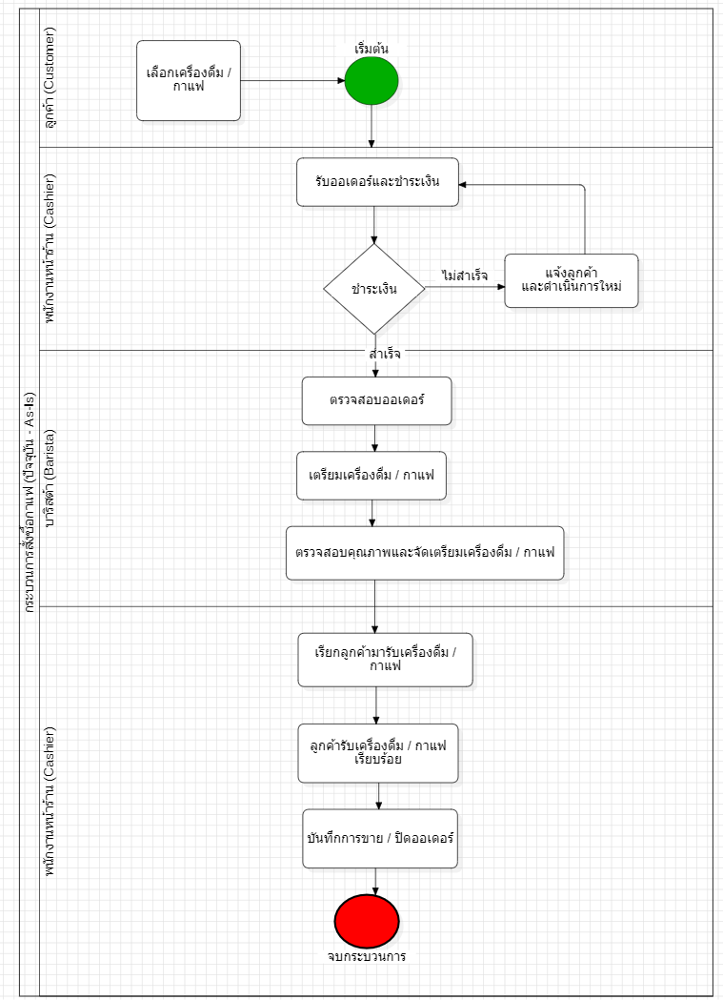
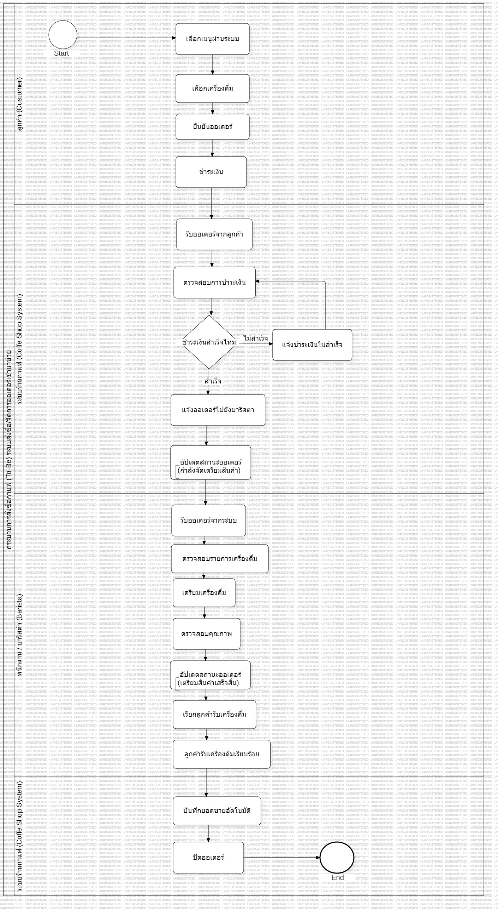

# WK02 – Feasibility-report

## 1. โครงสร้างรายงานความเป็นไปได้อย่างย่อ

| หัวข้อ | เนื้อหา |
|--------|---------|
| **ภาพรวมโครงการ** | ระบบ POS ร้านกาแฟ 3–5 สาขา เพื่อช่วยรับออเดอร์ คิดเงิน จัดการสต็อก และสรุปยอดขายของทุกสาขา ผู้ใช้งานหลักคือเจ้าของร้าน ผู้จัดการสาขา และพนักงานหน้าร้าน |
| **Technical Feasibility** | ใช้ Node.js, Express และ MySQL ทีมมีความรู้ด้านการพัฒนาเว็บในระดับพื้นฐานถึงปานกลาง ความเสี่ยงคือการเชื่อมต่อฐานข้อมูลและการใช้งานพร้อมกันหลายสาขา |
| **Economic Feasibility** | ต้นทุนพัฒนาและอุปกรณ์ประมาณ **50,000 บาท** ค่าโฮสติ้งและบำรุงรักษาประมาณ **1,500 บาท/เดือน** ระบบช่วยลดความผิดพลาดในการรับออเดอร์ ลดการใช้กระดาษ และเพิ่มประสิทธิภาพการทำงาน คาดว่าคืนทุนภายใน **8–12 เดือน** |
| **Operational Feasibility** | พนักงานแต่ละสาขาประมาณ **2–3 คน** สามารถเรียนรู้การใช้งานระบบได้ภายใน **1 ชั่วโมง** ระบบช่วยให้การรับออเดอร์ การคิดเงิน และการตรวจสอบสต็อกเป็นมาตรฐานเดียวกันทุกสาขา |
| **Schedule Feasibility** | ใช้เวลาพัฒนาโครงการประมาณ **12 สัปดาห์** โดยแบ่งเป็น วิเคราะห์ความต้องการ (สัปดาห์ 1–2), ออกแบบระบบ (3–4), พัฒนาระบบ (5–8), ทดสอบ (9–10) และปรับปรุงพร้อมส่งมอบ (11–12) |
| **ข้อสรุป** | โครงการมีความเป็นไปได้ในการดำเนินงาน เนื่องจากมีความพร้อมด้านเทคนิค ใช้งบประมาณเหมาะสม สามารถพัฒนาได้ภายในระยะเวลาที่กำหนด และช่วยเพิ่มประสิทธิภาพการบริหารร้านกาแฟ 3–5 สาขา ได้อย่างมีประสิทธิภาพ |

---

## 2. วาด BPMN diagram แบบ As-Is

---

## 3. วาด BPMN diagram แบบ To-Be

---

## 4.อภิปรายในกลุ่มว่า BPMN แบบ To-Be ช่วยแก้ปัญหาที่ระบุใน Operational และ Economic Feasibility อย่างไร

#### BPMN แบบ To-Be ช่วยแก้ปัญหาใน Operational Feasibility อย่างไร

- กำหนดขั้นตอนการทำงานที่ชัดเจนและเป็นมาตรฐานเดียวกันทุกสาขา
- ลดความผิดพลาดในการรับออเดอร์และการคิดเงิน
- ช่วยให้พนักงานเรียนรู้การทำงานได้ง่ายขึ้น และลดเวลาในการฝึกอบรม
- เพิ่มความรวดเร็วในการให้บริการลูกค้า

#### BPMN แบบ To-Be ช่วยแก้ปัญหาใน Economic Feasibility อย่างไร

- ลดต้นทุนจากความผิดพลาดในการรับออเดอร์และการคิดเงิน
- ลดการใช้กระดาษและงานเอกสารด้วยระบบดิจิทัล
- เพิ่มประสิทธิภาพการทำงาน ทำให้พนักงานให้บริการลูกค้าได้มากขึ้นในเวลาเท่าเดิม
- ช่วยให้ร้านบริหารสต็อกและยอดขายได้ดีขึ้น ส่งผลให้คุ้มค่าต่อการลงทุนและคืนทุนได้เร็วขึ้น
